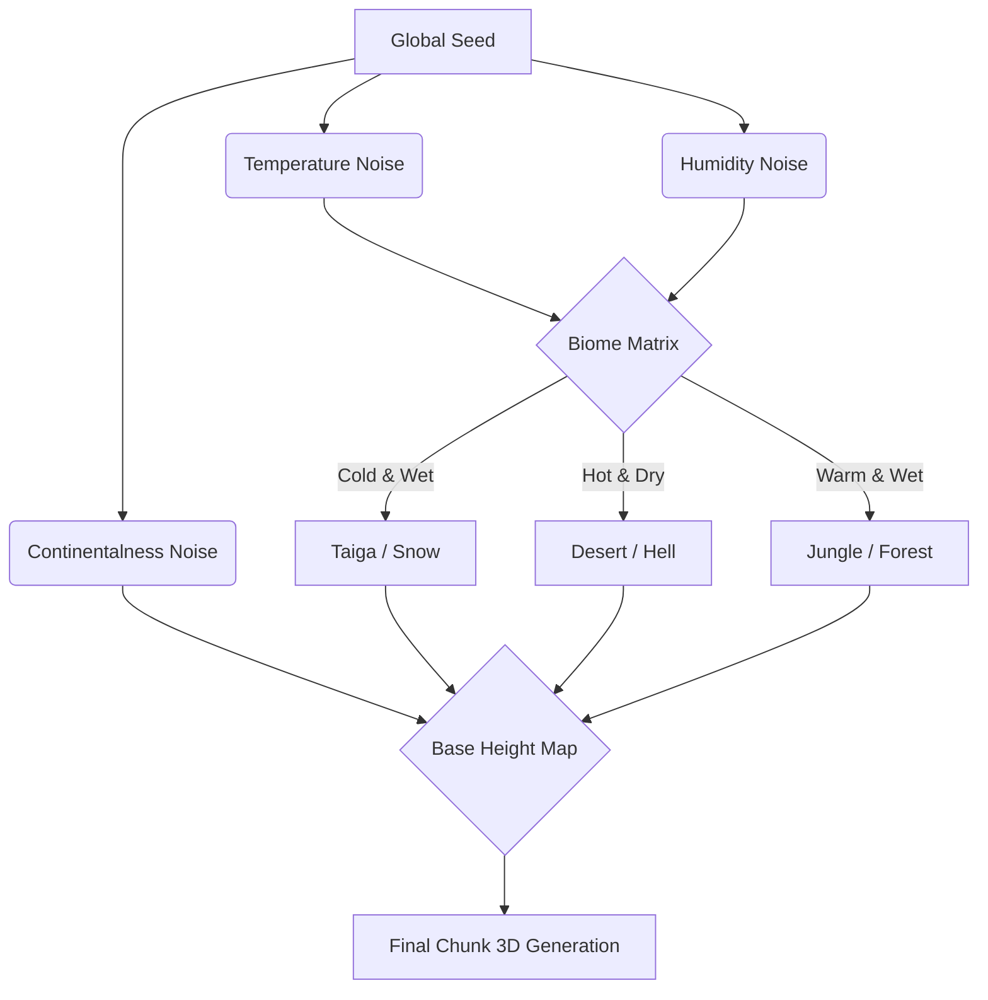
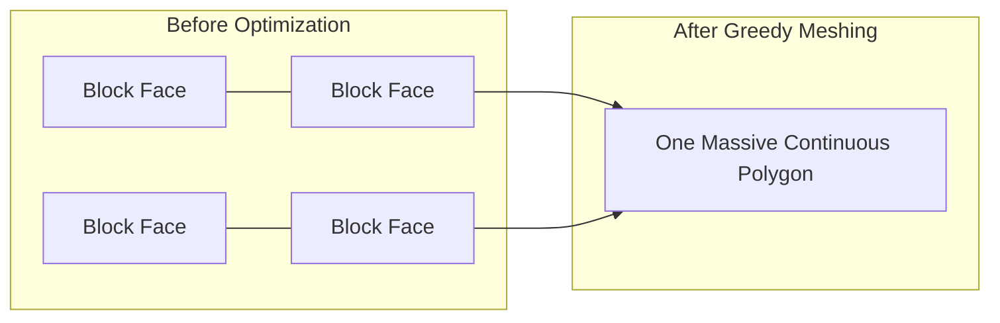
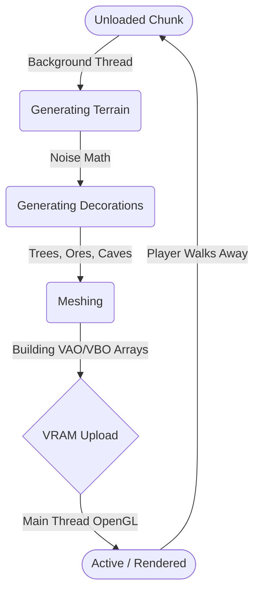

<div align="center">
  
  
  # 🟩 Pythoncraft Engine
  **The Most Advanced, Highly Optimized Voxel Engine & Minecraft Clone in Python.**
  
  [](https://www.python.org/)
  [](https://pyglet.org/)
  [](https://numba.pydata.org/)
  [](https://discord.gg/bjktPVb9GJ)
  []()
  
  *Pythoncraft is a revolutionary sandbox voxel engine designed to push the boundaries of what Python can do. Through aggressive multi-threading, hardware-accelerated OpenGL graphics, Numba JIT (Just-In-Time) compilation, and complex noise mathematics, Pythoncraft delivers massive infinite worlds, rich biomes, and a fully functional crafting ecosystem—without sacrificing framerate.*
</div>

---

## 📖 Table of Contents
1. [The Engine Philosophy](#-the-engine-philosophy)
2. [Deep Dive: Procedural Terrain & Noise](#-deep-dive-1-procedural-terrain--noise-mathematics)
3. [Deep Dive: Graphics, Meshing & Optimizations](#-deep-dive-2-graphics-pipeline--greedy-meshing)
4. [Deep Dive: Asynchronous Chunk Architecture](#-deep-dive-3-the-asynchronous-chunk-architecture)
5. [Features at a Glance](#-features-at-a-glance)
6. [Media Gallery](#-media-gallery)
7. [Installation & Controls](#-getting-started)
8. [License & Attribution](#-license--attribution)

---

## 🏛️ The Engine Philosophy

Historically, writing a high-performance voxel game in Python is considered nearly impossible due to the **Global Interpreter Lock (GIL)** and the slow execution speed of Python `for` loops. Generating a single chunk of $16 \times 256 \times 16$ blocks involves iterating over 65,536 blocks, calculating 6 faces for each, and checking neighbors. Pure Python would run this at 2 FPS.

**Pythoncraft solves this.** By utilizing C-level compilation via `Numba`, modern OpenGL (GLSL) shaders, and extreme memory management, Pythoncraft proves that Python can run complex 3D simulations smoothly.

---

## 🧠 Deep Dive 1: Procedural Terrain & Noise Mathematics

Pythoncraft does not just generate flat grass. It utilizes complex layered **Perlin Noise** and **Fractal Brownian Motion (fBm)** to create realistic, infinite continents, mountains, oceans, and biomes.

### 🗺️ The Biome Mapping System
The world generates based on multiple overlapping 2D noise maps. The intersection of these maps decides the environment:
1. **Temperature Map:** Determines if the region is frozen (Ice Flats) or scorching (Desert).
2. **Humidity/Rainfall Map:** Determines if the region is dry (Desert) or wet (Jungle / Swampland).
3. **Continentalness:** Determines the base height (Oceans vs. Landmasses).



### ⛰️ 3D Noise for Cave Generation
Standard 2D heightmaps cannot generate overhangs or caves. Pythoncraft utilizes **3D Perlin Noise** (`mc_caves.py`). The engine evaluates a noise value $(x, y, z)$ for every single block underground. If the noise density falls below a certain threshold, the block is carved out as AIR, creating beautiful, sprawling, interconnected cave systems beneath your feet.

---

## ⚡ Deep Dive 2: Graphics Pipeline & Greedy Meshing

### 🧱 Why is Voxel Rendering Hard?
A single chunk has 65,536 blocks. If we render 6 faces per block, that is ~393,216 polygons *per chunk*. If your render distance is 8 (289 chunks), you are sending **113 Million polygons** to the GPU every frame. The GPU will instantly crash.

### 🛠️ The Solution: Numba JIT & Greedy Meshing
Pythoncraft employs a **Greedy Meshing Algorithm** written in pure math and compiled to C-code via `@njit(nogil=True)`. 

1. **Face Culling:** The engine first checks every block. If a block is completely surrounded by other opaque blocks, it is completely deleted from the mesh.
2. **Greedy Meshing:** The engine then looks at visible faces. If 5 adjacent blocks have the exact same texture (e.g., a flat grass wall), the algorithm merges them into **ONE single giant polygon** instead of 5 separate ones.

#### Visualizing Greedy Meshing:


This algorithm merges adjacent blocks with the same texture, reducing the polygon count by over **90%**, allowing massive render distances without crashing the GPU.

### 🌑 Voxel Ambient Occlusion (VAO)
To make the lighting look realistic and "soft" rather than flat, Pythoncraft calculates AO directly in the vertex data. For every vertex of a block, the Numba compiler checks the 3 diagonal neighboring blocks. If they are solid, it darkens that specific corner vertex, resulting in stunning, hardware-less shadow gradients.

---

## 🧵 Deep Dive 3: The Asynchronous Chunk Architecture

In infinite worlds, generating a chunk takes CPU time (doing all the noise math). If we did this on the main game loop, the game would "freeze" for 0.5 seconds every time you walked into a new area.

Pythoncraft uses a robust **`ThreadPoolExecutor`** State Machine.



**Frustum Culling:** Even when chunks are loaded, Pythoncraft calculates the exact mathematical cone of your camera vision. Any chunk behind your head is instantly skipped during the OpenGL draw call, saving massive GPU resources.

---

## 💾 Deep Dive 4: SQLite Data Persistence
Minecraft worlds are huge. Storing modified blocks in RAM would eventually crash your computer. 
Instead, Pythoncraft connects to an asynchronous SQLite database (`world_db.py`). 
- When you break a block, the chunk is flagged as "dirty".
- When you walk away and the chunk unloads, the background thread compresses the chunk data and saves it instantly to the SQLite disk file. 
- When you return, the database is queried at lightning speed, reloading your exact creations without RAM bloat.

---

## 🔥 Features at a Glance

### 🌍 Infinite World Generation
- **23+ Unique Biomes:** Explore diverse landscapes including Plains, Deserts, Extreme Hills, Jungles, Swamplands, Taiga, and Mushroom Islands (`mc_biomes.py`).
- **Complex Cave Systems:** 3D noise carves interconnected caves (`mc_caves.py`).
- **Rich Ore Veins:** Coal, iron, gold, and diamonds scatter beneath the earth.

### 🛠️ Crafting & Inventory Ecosystem
- **JSON-Driven Crafting:** Hundreds of recipes mapped directly to metadata (`recipes.json`).
- **Interactive Crafting Tables:** Combine raw materials to survive and build.
- **Physical Item Drops:** Destroying blocks drops rotating 3D item entities that obey physics (`item_entity.py`).

### 🐖 Artificial Intelligence & Mobs
- **Living Ecosystem:** AI-driven animals like Pigs (`pig.py`) that wander, avoid obstacles, and react to the player.
- **Biome-Specific Spawners:** Different biomes spawn different entities.

### 🎵 Immersive Physics & Audio
- **Spatial 3D Audio:** `sound_system.py` plays dynamic sounds based on footstep materials, block breaking, and mob proximity.
- **Particle System:** Breaking a block spawns physical mini-blocks that bounce on the terrain (`particle_entity.py`).

---

## 📸 Media Gallery

| **Crafting Engine Architecture** | **AI Mobs (Pigs)** |
|:---:|:---:|
|  |  |
| **smooth biome transition** | **Endless Voxel Biomes** |
|  | ** |

---

## 🚀 Getting Started

### 1. Clone the Repository
```bash
git clone https://github.com/kivi-man/Python-craft.git
cd pythoncraft
```

### 2. Install Dependencies
```bash
pip install -r requirements.txt
```

### 3. Play the Game
```bash
python main.py
```
*(Tip: Use the included `guncelleme_araci.bat` to automatically pull community updates and start the game!)*

---

### ⚙️ Command-Line Optimizations
Fine-tune the engine for your exact hardware constraints:
- **Render Distance:** `python main.py 6` (sets render distance to 6 chunks).
- **Simulation Distance:** `python main.py -sim 4` (controls how far away entities and world events are simulated, freeing up CPU).
- **Fast Leaves:** `python main.py -fast` (makes leaves opaque, skipping transparency sorting for a huge FPS boost).
- **Debug Profiler:** `python main.py -debug` (displays profiling, chunk state queues, memory usage, and advanced F3 metrics).

```bash
python main.py 8 -sim 4 -fast -debug
```

---

## 🎮 Interface & Controls

- **Movement:** `W`, `A`, `S`, `D`
- **Jump/Fly:** `Space` (Double tap or press `Tab` to toggle Fly Mode)
- **Crouch/Descend:** `Shift`
- **Action 1 (Break):** `Left Click`
- **Action 2 (Place/Interact):** `Right Click`
- **Hotbar Navigation:** `1` - `6` or **Scroll Wheel**
- **Pause/Menu:** `ESC`

---

## 📦 Build your own Executable

Share the game with friends who don't have Python installed. The repository includes an automated build script:
```bash
build.bat
```
This leverages PyInstaller to compile the entire Pythoncraft engine, Numba libraries, and assets into a blazing-fast, standalone `.exe` file located in the `dist/` folder.

---

## 🔮 Upcoming Features / Roadmap
- **Fluid Mechanics:** Realistic water physics, swimming, and flow systems.
- **Multiplayer Networking:** Cross-platform server integration.
- **More Mobs & Entities:** Expanding the ecosystem beyond pigs.

---

## 🤝 Community & Contributing
Pythoncraft is an ambitious project aiming to faithfully recreate vanilla mechanics while maintaining clean, modular, object-oriented Python code. 

Whether it's optimizing Numba algorithms, adding new shaders, expanding `recipes.json`, or writing new AI behaviors in `core/ai/`, we welcome all Pull Requests!

---

## ⚖️ License & Attribution

This project is open-source and free to use, modify, and fork under the provided License.

⚠️ **CRITICAL MANDATORY RULE:** 
If you fork, redistribute, or use this code in your own project, **you must explicitly credit the original creator: the GitHub user `Kivi-man`**. You must also clearly state that the code was originally obtained from this repository. Failure to provide this attribution violates the terms of the License.
